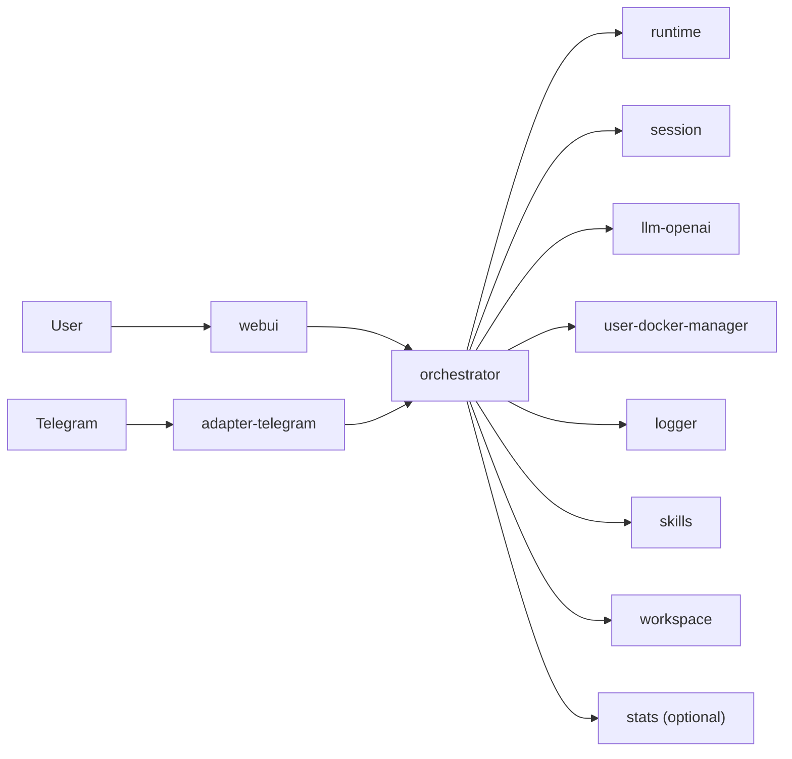

# WhalesBot MVP

Default root documentation is Chinese. Chinese version: [`README.md`](README.md).

WhalesBot MVP is a single-host, Docker Compose based multi-service AI orchestration system.
The design goal is not to put every capability into one process, but to keep capabilities
as independent services and expose a unified entry through the orchestrator.

## User-Facing Philosophy

- Unified entry: users mainly interact with `orchestrator` and `webui`.
- Service autonomy: each component runs, registers, and health-checks independently.
- Swap-friendly: model gateway, user I/O adapters (e.g. Telegram), and tools can evolve per service.
- Usable first: even without full external credentials, the stack still boots for integration tests.

## Architecture (High Level)



## Quick Start (User Path)

1. Initialize env file

```bash
cp .env.example .env
```

2. Fill `.env` values as needed

- `TELEGRAM_BOT_TOKEN`: if empty, `adapter-telegram` starts and registers, but skips long polling.
- LLM upstream URL, keys, and model ids are not set in root `.env`; configure on the `llm-openai` service (defaults use echo mode without a key).

3. Start all services

```bash
docker compose up --build
```

4. Access

- WebUI: `http://localhost:3000`
- Orchestrator API: `http://localhost:8080`

## Repository Layout (Framework Only)

Root README keeps framework-level info only; implementation details live in each module README.

- `orchestrator/`: orchestration and API gateway
- `runtime/`: ReAct execution loop
- `session/`: conversation persistence
- `skills/`: skill library (SQLite + FTS5) behind orchestrator `/api/v1/skills*`
- `llm-openai/`: model adapter/client
- `adapter-telegram/`: Telegram user I/O adapter
- `user-docker-manager/`: user docker system manager (list/create/remove/restart/interface discovery)
- `logger/`: logging service
- `stats/`: optional Overview metrics service
- `memory/`: memory service (source + roadmap; not started by default compose — see `memory/TODO.md`)
- `workspace/`: workspace service
- `userdocker-base/`: base image for dynamic userdocker instances
- `whalesbot/userdocker-golang:latest`: Go-toolchain image variant for dynamic userdocker compile tasks
- `webui/`: frontend

## Documentation Priority

If docs disagree, trust this order:

1. `docker-compose.yml` (runtime truth)
2. `.env.example` (configuration truth)
3. `AGENT.md` (low-token project snapshot for AI agents)
4. Root and module READMEs

## Contribution Note

Before committing contributions, update `AGENT.md` together with your code changes
whenever architecture, service map, ports, env vars, runbook, or project status changed.
