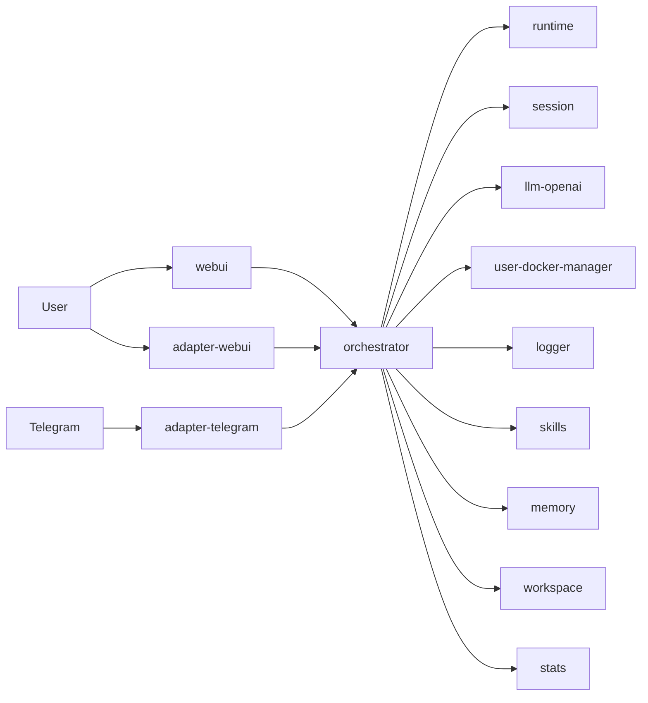

# WhaleBot

[](LICENSE)
[](https://go.dev/)
[](https://docs.docker.com/compose/)
[](https://github.com/WhaleTrue/WhaleBot/stargazers)

Default root documentation is Chinese. Chinese version: [`README.md`](README.md).

WhaleBot is a Docker Compose based multi-service AI orchestration system. A single host runs the full stack; `userdocker` work containers can additionally be distributed across machines — remote nodes only need outbound access to the orchestrator (no public address required, see `docker-compose.node.yml`).
The design goal is not to put every capability into one process, but to keep capabilities
as independent services and expose a unified entry through the orchestrator.

This project is **developer-first**: it aims to maximize composability and swap freedom when you build agents. Treat the bundled services as a starting point—replace any layer with your own images or add parallel components without rewriting a monolith.


## Design Philosophy and Architecture

- **Containers as components**: each capability runs in its own container, registers with the orchestrator, and joins the stack; components run and health-check independently.
- **Hot-swap and replaceability**: the default Compose file ships a runnable baseline; you can plug in custom tool containers, adapters, or model gateways to extend agent behavior without rewriting core orchestration.
- **How capabilities grow**: implement a tool (or environment) container with the right surface area, register it as prescribed, and `runtime` can discover and call it. See `orchestrator/`, `runtime/`, and each module README for mechanics.
- **Working with Docker**: agents can already create and manage dynamic containers via paths such as `user-docker-manager`; architecture naturally extends toward agents authoring new tools or containers, while **interface and lifecycle contracts are still being formalized** (schemas and docs will follow).
- **Unified entry**: day-to-day use centers on `orchestrator` and `webui`.
- **Usable first**: the stack still boots for local integration even when some external credentials (model keys, Telegram tokens) are missing.

## What This Repository Represents

The repo ships a **working reference paradigm**: it shows how components collaborate and how to close a minimal conversational loop.
That paradigm is **not** the ceiling of what your agents can do—the ceiling is the ecosystem of components and contracts you plug in, not how much logic lives in one process.

## Architecture (High Level)


```mermaid
flowchart LR
  user["User"] --> webui["webui"]
  user --> adapterWebui["adapter-webui"]
  tg["Telegram"] --> adapterTelegram["adapter-telegram"]
  webui --> orchestrator["orchestrator"]
  adapterWebui --> orchestrator
  adapterTelegram --> orchestrator
  orchestrator --> runtime["runtime"]
  orchestrator --> session["session"]
  orchestrator --> llmOpenai["llm-openai"]
  orchestrator --> toolDocker["user-docker-manager"]
  orchestrator --> logger["logger"]
  orchestrator --> skills["skills"]
  orchestrator --> memory["memory"]
  orchestrator --> workspace["workspace"]
  orchestrator --> stats["stats"]
```

## Quick Start

After the stack is up, configure **LLM** and a **Telegram bot token** in WebUI; you can then chat with your bot directly in the Telegram client (traffic flows through `adapter-telegram` into orchestration and `runtime`).

1. **Environment file**

Root `.env` holds Compose-wide values; **do not** put model API secrets there (LLM settings live on the `llm-openai` side / WebUI—see `AGENTS.md`).

```bash
cp .env.example .env
```

Edit `.env` as needed; defaults are often enough at first.

2. **Start the stack**

```bash
docker compose up -d --build
```

3. **Open WebUI and sign in**

Browse to `http://localhost:18000` and complete **initial dashboard sign-up** (credentials persist in the `webui` volume).

4. **Create a Telegram bot (if you do not have one)**

In Telegram, open [@BotFather](https://t.me/BotFather), send `/newbot`, and follow the prompts for display name and username. BotFather returns an **HTTP API token**—save it for the next step. See also [Telegram’s bot overview](https://core.telegram.org/bots#6-botfather).

5. **Configure LLM and Telegram in WebUI**

- **LLM**: on the **LLM** page, set upstream URL, API key, and model id (persisted on the `llm-openai` side, e.g. the default `LLM_CONFIG_PATH` JSON). A missing/invalid key is only useful for placeholder / echo wiring, not real conversations.
- **Telegram**: on **Adapters**, paste the token into `adapter-telegram`; optionally restrict by user ID whitelist. **Without a token**, the service still registers but does not long-poll, so Telegram will not deliver traffic.

With both configured, `adapter-telegram` starts polling—open your bot in Telegram and send a message.

Prefer the browser? The built-in **web chat** (`adapter-webui`) is available at `http://localhost:18083` with the same default credentials as WebUI.

6. **Orchestrator API (optional)**

HTTP gateway: `http://localhost:18080`

**About the bundled example**: the repo ships **two** user-facing adapters (Telegram and web chat) and **one** OpenAI-compatible LLM path (`llm-openai`) forming a runnable conversational loop; WebUI also includes a **model Benchmark** page for comparing local models over time. More adapters and backends will get easier as component **schemas** and AGENT docs mature (see `docs/adapter-progress-pattern.md` for the adapter progress pattern).

## Roadmap / Near-Term Direction

- Formalize interface **schemas** for components and ship matching **AGENT** documentation so new components are cheap to author or generate.
- Improve Docker **lifecycle** management and orchestration ergonomics so agents interact with containers more smoothly.
- Refine prompts and the ReAct workflow.
- Add more common **adapters**.
- Finer-grained work lives in per-module TODOs and Issues.

## Repository Layout

High-level map only; each directory has its own README for implementation detail.

- `orchestrator/`: orchestration and API gateway (component registry/heartbeats, node tunnel hub, reverse proxies)
- `runtime/`: ReAct execution loop (includes the model benchmark harness)
- `session/`: conversation persistence (SQLite, idle expiry)
- `skills/`: skill library (filesystem skill packages + SQLite FTS5 search index); exposed via orchestrator routes such as `/api/v1/skills*`
- `llm-openai/`: OpenAI-compatible model adapter/client (multi-profile, managed via WebUI)
- `adapter-telegram/`: Telegram user I/O adapter
- `adapter-webui/`: ChatGPT-style web chat adapter (host port 18083)
- `user-docker-manager/`: user docker system manager (list/create/remove/restart/interface discovery); one instance per node machine, connected through an outbound reverse tunnel
- `logger/`: logging service (persistent events)
- `stats/`: Overview metrics service (optional; stop the container to disable metrics)
- `memory/`: memory service (KV notes + AES-256-GCM encrypted secrets store; agents reference secrets via `{{secret:key}}` placeholders)
- `workspace/`: workspace service
- `userdocker-base/`: base image for dynamic userdocker instances
- `whalebot/userdocker-golang:latest`: Go-toolchain image variant for dynamic userdocker compile tasks (produced from the `userdocker-base` build flow)
- `webui/`: dashboard frontend (Svelte + Caddy, with sign-in auth)

## Documentation Priority

If docs disagree, trust this order:

1. `docker-compose.yml` (runtime truth)
2. `.env.example` (configuration truth)
3. `AGENTS.md` (low-token project snapshot for AI agents)
4. Root and module READMEs

## Contribution Note

Before committing contributions, update `AGENTS.md` together with your code changes
whenever architecture, service map, ports, env vars, runbook, or project status changed.
