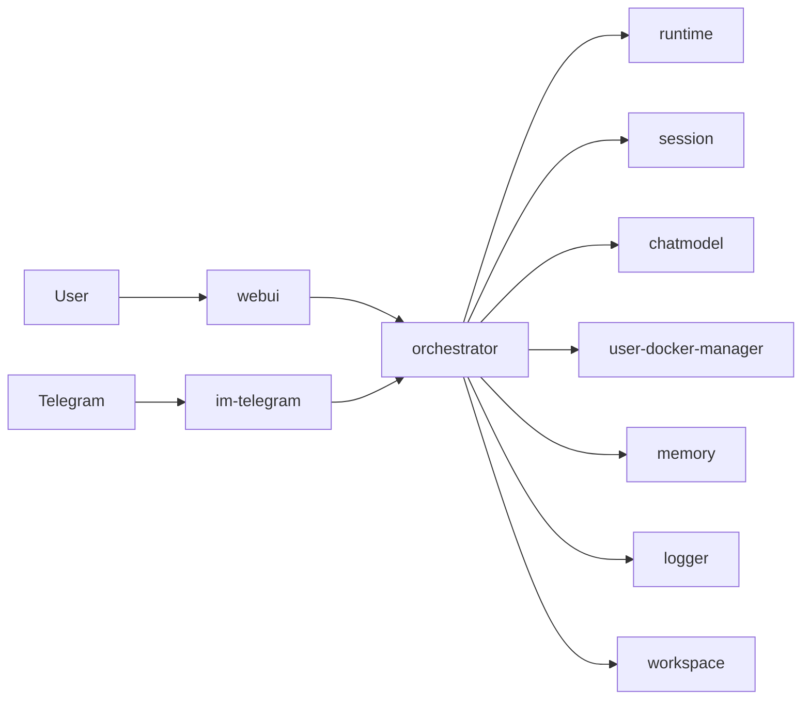

# WhalesBot MVP

默认文档语言为中文。English version: [`README.en.md`](README.en.md)。

WhalesBot MVP 是一个运行在单机 Docker Compose 上的多组件 AI 编排系统。  
它的目标不是把所有能力塞进一个进程，而是让各能力作为独立服务协作，并由编排层统一对外提供入口。

## 面向使用者的核心理念

- 统一入口：你只需要关注 `orchestrator` 与 `webui` 两个对外入口。
- 组件自治：各服务独立运行、独立注册、独立健康检查。
- 可替换：模型、IM 网关、工具环境等能力可以按服务级替换，而不需要重写整体系统。
- 先可用再扩展：即便没有完整外部依赖（如模型 key、Telegram token），系统也尽可能保持可启动和可联调。

## 系统框架（整体视图）



## 快速开始（使用者路径）

1. 初始化环境变量

```bash
cp .env.example .env
```

2. 按需填写 `.env`（最常见）

- `MODEL_API_KEY`：为空时 `chatmodel` 会走 echo 模式（便于流程联调）。
- `TELEGRAM_BOT_TOKEN`：为空时 `im-telegram` 会启动并注册，但不进入长轮询。

3. 启动系统

```bash
docker compose up --build
```

4. 访问入口

- WebUI: `http://localhost:3000`
- Orchestrator API: `http://localhost:8080`

## 仓库结构（仅保留总览）

根 README 只提供框架级信息；实现细节请查看各模块自己的 README。

- `orchestrator/`：编排与网关
- `runtime/`：ReAct 执行循环
- `session/`：会话持久化
- `chatmodel/`：模型调用适配
- `im-telegram/`：Telegram 网关
- `user-docker-manager/`：`user docker` 系统管理工具（枚举/新建/移除/重启/接口发现）
- `logger/`：日志服务
- `memory/`：记忆服务
- `workspace/`：工作区服务
- `userdocker-base/`：动态 userdocker 基础镜像
- `whalesbot/userdocker-golang:latest`：动态 userdocker 的 Go 编译镜像（由 `userdocker-base` 构建变体生成）
- `webui/`：前端界面

## 文档与信息优先级

当信息不一致时，按以下顺序判断：

1. `docker-compose.yml`（运行事实）
2. `.env.example`（配置事实）
3. `AGENT.md`（面向 AI agent 的低 token 项目快照）
4. 根 `README.md` 与各模块 `README.md`（说明文档）

## 贡献说明

提交贡献前，请同步检查并更新 `AGENT.md`。  
只要你的改动影响了架构、服务清单、端口、环境变量、运行方式或项目状态，就必须在同一提交中更新 `AGENT.md`。
