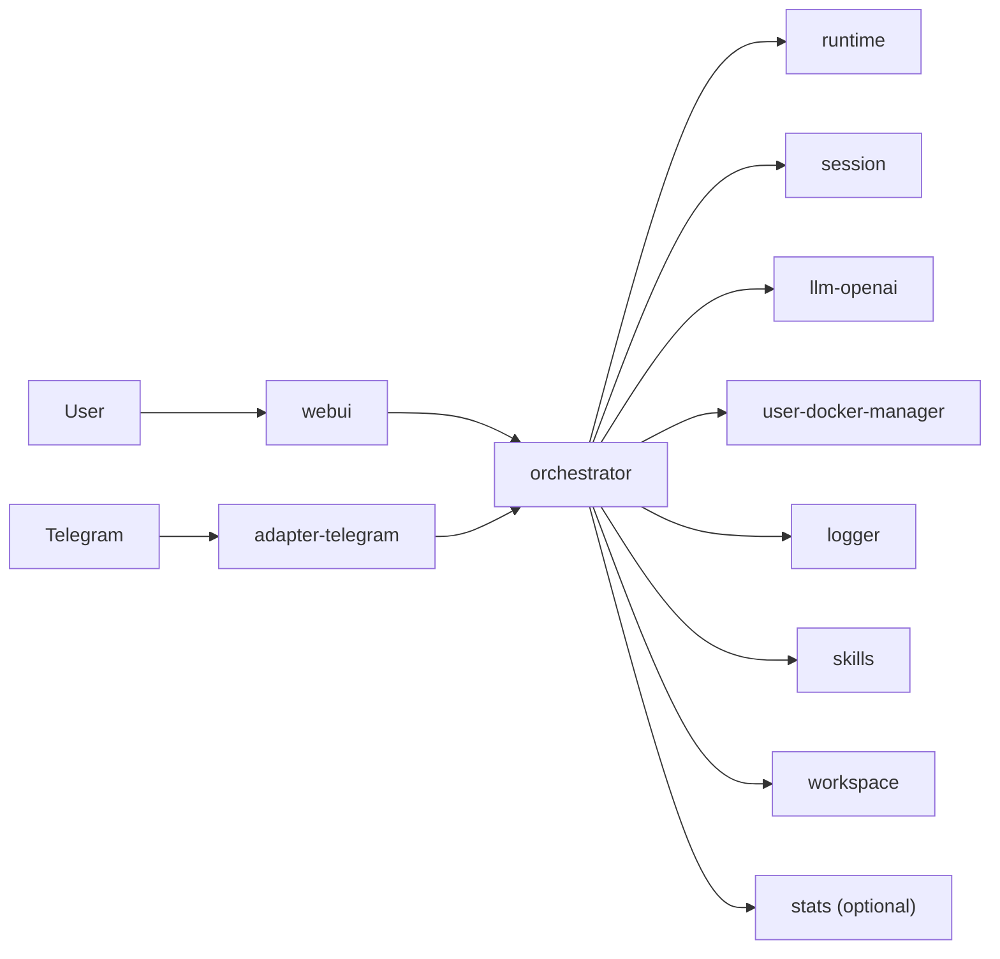

# WhaleBot

默认文档语言为中文。English version: [`README.en.md`](README.en.md)。

WhaleBot 是一个运行在单机 Docker Compose 上的多组件 AI 编排系统。  
它的目标不是把所有能力塞进一个进程，而是让各能力作为独立服务协作，并由编排层统一对外提供入口。

本项目**面向开发者**：希望为构建智能体的人提供尽可能高的组合与替换自由。你可以把仓库里自带的服务当作起点，用自建镜像替换或并行扩展其中任意一环，而不必 fork 单体应用后再改天换地。

## 设计理念与架构原则

- **容器即组件**：每种能力运行在独立容器中，向编排层注册后接入整体；组件可独立部署、独立健康检查。
- **热插拔与可替换**：默认 compose 提供一套可运行的初始组件；你随时可以接入自己构建的 tool 容器、适配器或模型网关，扩展智能体能力而不重写核心编排。
- **能力如何生长**：需要新能力时，实现对应功能的 tool（或环境）容器，按注册约定接入框架后，`runtime` 即可发现并调用。实现细节见 `orchestrator/`、`runtime/` 及各模块 README。
- **与 Docker 的协同**：智能体可通过现有路径（例如 `user-docker-manager`）创建与管理动态容器；在架构上也可以延伸到「由智能体自建 tool、自我扩展能力」等场景，但接口与生命周期规范仍在完善中，后续会以 schema 与文档形式固化。
- **统一入口**：日常使用主要面对 `orchestrator` 与 `webui`。
- **先可用再扩展**：即便缺少部分外部凭据（例如模型 key、Telegram token），栈仍尽可能保持可启动、可联调。

## 范式定位

当前仓库提供的是一套**可运行的参考范式**：它演示了组件如何协作、如何接到最小可用的对话闭环。  
范式本身**不是**智能体能力的上限——上限取决于你接入的组件生态与规范，而不是把更多逻辑塞进单个进程。

## 系统框架（整体视图）



## 快速开始

完成环境启动并在 WebUI 中配好 **LLM** 与 **Telegram Bot Token** 后，即可在 Telegram 客户端里直接与你的 Bot 私聊（消息经 `adapter-telegram` 进入编排与 `runtime`）。

1. **准备环境变量**

根目录 `.env` 主要承载 Compose 与通用变量；**不必**在根文件里配置模型 API 密钥（模型侧在 `llm-openai` 数据卷 / WebUI 中配置，见 `AGENT.md`）。

```bash
cp .env.example .env
```

按需编辑 `.env`；多数场景可先保留示例默认值。

2. **启动系统**

```bash
docker compose up -d --build
```

3. **打开 WebUI 并登录**

浏览器访问 `http://localhost:3000`，按界面完成**初始账号**（凭据在 `webui` 数据卷中持久化）。

4. **创建 Telegram Bot（若还没有）**

在 Telegram 中打开 [@BotFather](https://t.me/BotFather)，发送 `/newbot`，按提示设置显示名与用户名；创建成功后 BotFather 会给出 **HTTP API token**，复制备用。更细的说明见 [Telegram Bots 介绍](https://core.telegram.org/bots#6-botfather)。

5. **在 WebUI 中配置 LLM 与 Telegram**

- **LLM**：在 **LLM** 页配置上游地址、API 密钥与模型等（写入 `llm-openai` 侧，例如默认 `LLM_CONFIG_PATH` JSON）。无有效密钥时仅适合本地占位 / echo 联调，无法支撑真实对话质量。
- **Telegram**：在 **适配器** 页为 `adapter-telegram` 填入上一步的 **bot token**；可按需设置用户 ID 白名单。**未填 token** 时服务仍会注册，但不会长轮询，Telegram 侧收不到消息。

两者均配置有效后，`adapter-telegram` 开始轮询，即可在 Telegram 里搜索你的 Bot 并发送消息进行对话。

6. **API 入口（可选）**

编排层 HTTP：`http://localhost:8080`

**关于当前内置示例**：仓库目前只内置**一个**用户侧适配器（Telegram）与**一条** LLM 路径（`llm-openai`），用于构成最小可运行闭环。更多适配器与模型后端将随组件 **schema** 与 **AGENT** 文档完善后更易扩展。

## Roadmap / 近期方向

- 完善各类组件的接口 schema 定义，并配套 AGENT 文档，使开发者能低成本编写或生成新组件。
- 完善 Docker 生命周期管理，加强编排与 Docker 的交互能力，使智能体与容器的协作更顺滑。
- 优化提示词与 ReAct 工作流。
- 落地 `memory` 组件（进展见 [`memory/TODO.md`](memory/TODO.md)）。
- 增加更多常用 adapter。
- 更多细项以各模块 TODO 与 Issue 为准。

## 仓库结构

以下为高层说明；各目录的实现细节见对应子模块 README。

- `orchestrator/`：编排与网关
- `runtime/`：ReAct 执行循环
- `session/`：会话持久化
- `skills/`：技能库（SQLite + FTS5）；对外经 orchestrator 暴露 `/api/v1/skills*` 等路由
- `llm-openai/`：模型调用适配
- `adapter-telegram/`：Telegram 用户 I/O 适配器
- `user-docker-manager/`：`user docker` 系统管理（列举、创建、移除、重启、接口发现）
- `logger/`：日志服务
- `stats/`：可选的 Overview 统计服务
- `memory/`：记忆服务
  - 源码与路线图在仓库中维护；默认 compose 不启动该服务。详见 [`memory/TODO.md`](memory/TODO.md)。
- `workspace/`：工作区服务
- `userdocker-base/`：动态 userdocker 基础镜像
- `whalebot/userdocker-golang:latest`：动态 userdocker 的 Go 工具链镜像变体（由 `userdocker-base` 构建流程产出）
- `webui/`：前端界面

## 文档与信息优先级

当信息不一致时，按以下顺序判断：

1. `docker-compose.yml`（运行事实）
2. `.env.example`（配置事实）
3. `AGENT.md`（面向 AI agent 的低 token 项目快照）
4. 根 `README.md` 与各模块 `README.md`（说明文档）

## 贡献说明

提交贡献前，请同步检查并更新 `AGENT.md`。  
只要你的改动影响了架构、服务清单、端口、环境变量、运行方式或项目状态，就必须在同一提交中更新 `AGENT.md`。
